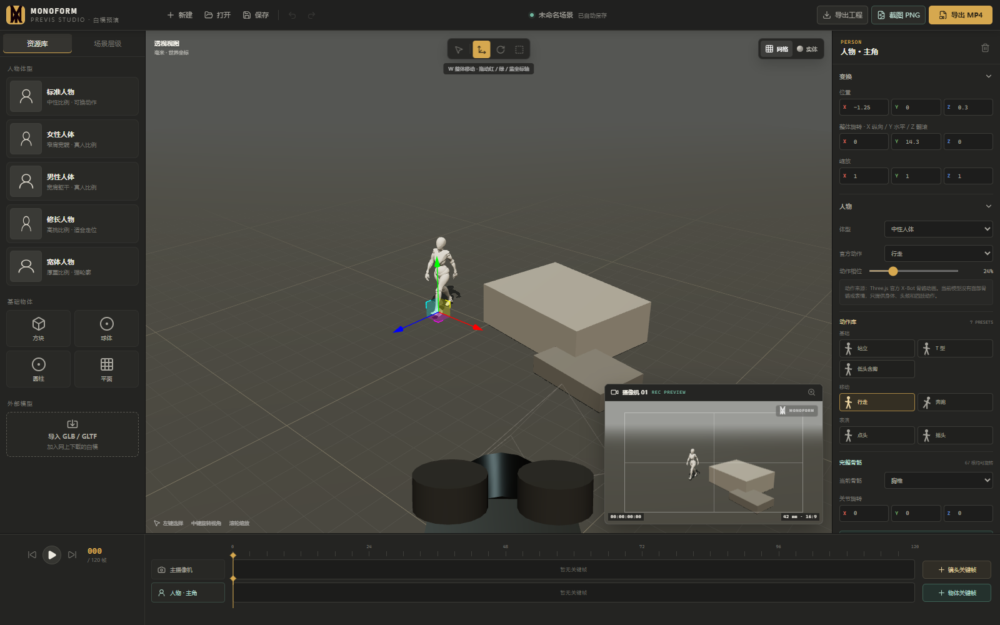
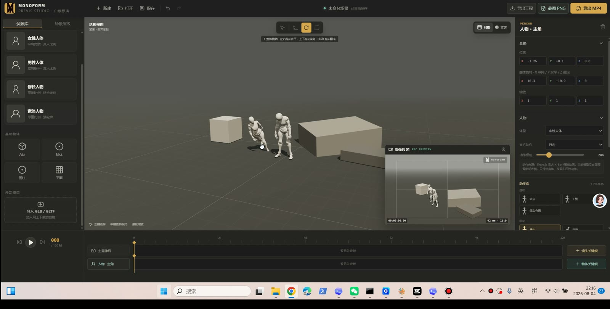
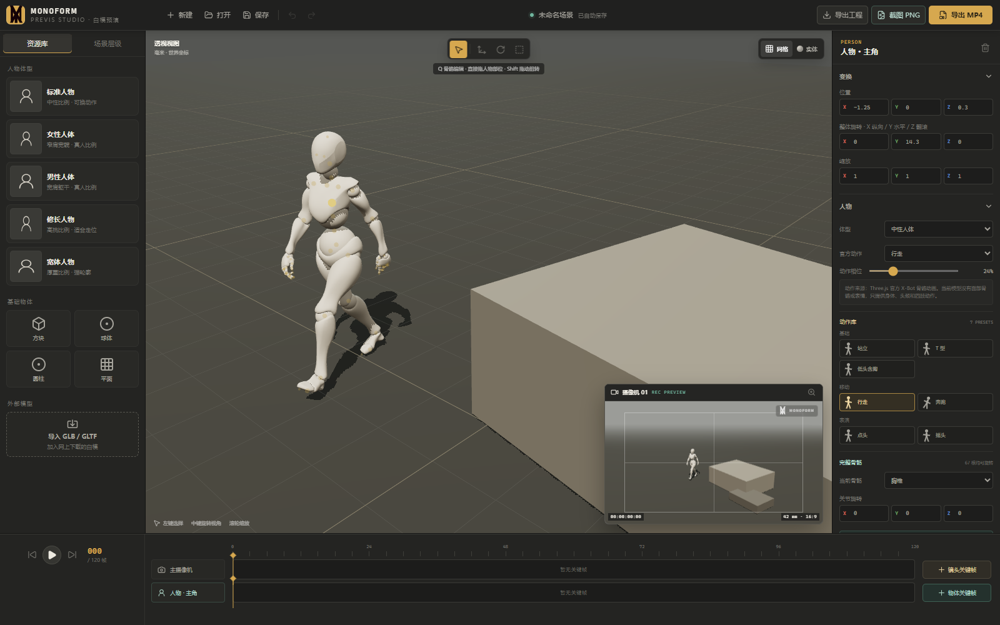
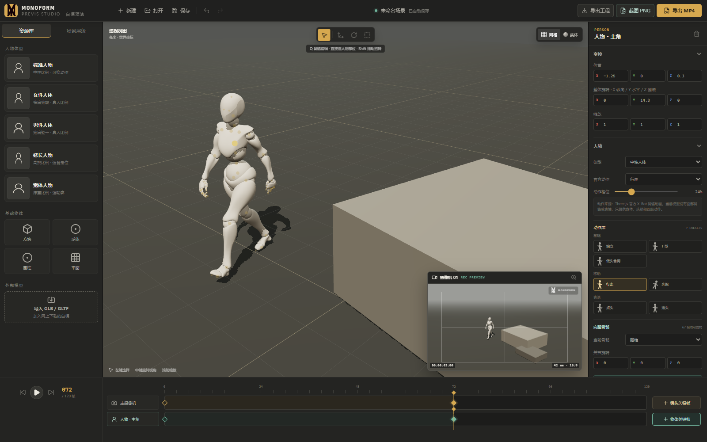

# MONOFORM · 素形白模预演工作台

MONOFORM 是一款面向分镜、构图和镜头预演的轻量三维白模工具。它直接运行在浏览器中，可搭建场景、摆放带骨骼人物、制作人物与摄像机关键帧，并导出 PNG 或 MP4。

## 在线使用

### [立即打开 MONOFORM](https://guiyi-xi.github.io/monoform-previs-studio/)

人物白模已经内置在项目中，无需另外下载或导入。在线版首次打开时，浏览器会从本站加载约 3 MB 的内置模型资源，之后通常会使用浏览器缓存。推荐使用最新版 Chrome 或 Edge，建议在电脑端全屏使用。



## 视频教学

[](https://guiyi-xi.github.io/monoform-previs-studio/tutorial/monoform-getting-started.mp4)

点击上方封面即可播放录屏教学。视频时长约 4 分 41 秒，包含声音；如果浏览器没有自动播放，可使用下面的链接直接打开或下载。

[播放或下载教学录屏 MP4](https://guiyi-xi.github.io/monoform-previs-studio/tutorial/monoform-getting-started.mp4)

## 界面说明

- 左侧「资源库」：添加人物、基础几何体、拱门、楼梯、门窗、家具、树木、车辆等场景粗模，或导入 GLB / GLTF 模型。
- 左侧「场景层级」：选择、显隐、锁定场景物体；选中后可在右侧重命名、复制、删除或聚焦。
- 中央「透视视图」：搭建三维场景、选择物体、调整观察角度。
- 右下「摄像机 01」：实时显示最终镜头画面，构图和焦距以这里为准。
- 右侧「属性面板」：编辑位置、旋转、缩放、人物动作、骨骼、颜色和摄像机参数。
- 底部「时间轴」：分别记录摄像机与当前物体的关键帧。

## 使用方式

### 1. 搭建场景

1. 在左侧点击一种「人物体型」，人物会加入场景并自动选中。
2. 点击「方块、球体、圆柱、平面」添加基础物体，也可直接添加拱门、楼梯、门窗、桌椅、沙发、屋顶、树木和车辆粗模。
3. 如果已有白模文件，点击「导入 GLB / GLTF」。单文件 `.glb` 的兼容性最好。
4. 选中物体后使用坐标轴拖动，也可以在右侧直接输入位置、旋转和缩放数值。
5. 按 `F` 或点击属性面板中的聚焦按钮，可快速把透视视图对准所选物体；锁定后空间变换会被禁用，避免误操作。

常用变换快捷键：

- `W`：移动，拖动红、绿、蓝坐标轴。
- `E`：旋转，可水平旋转、纵向俯仰和侧向翻滚。
- `R`：缩放。
- `Q`：人物摆姿；拖手脚控制点使用 IK，拖其他骨骼点旋转单根骨骼。

### 2. 调整人物和骨骼

1. 选中人物，在右侧的「动作预设」中选择站立、行走、奔跑、T 型等姿态或动作。
2. 拖动「动作相位」可选择行走或奔跑动画中的具体姿态。
3. 按 `Q` 进入关节编辑，人物身上会显示金色骨骼点和青绿色手脚控制点。
4. 拖动青绿色控制点可通过 IK 调整手腕或脚部位置；开启「脚底锁定」后，脚部 IK 会保持当前脚底高度，只沿地面移动。
5. 拖动人物其他部位或金色骨骼点可旋转单根骨骼；按住 `Shift` 左右拖可控制扭转，也可在右侧输入 X / Y / Z 角度。
6. 点击「保存当前姿势」可把动作存入本机姿势库，之后可一键应用或删除。自定义姿势保存在当前浏览器中，不会上传网络。
7. 使用「人物颜色」修改白模颜色。



### 3. 设置摄像机

1. 打开左侧「场景层级」，选择主摄像机。
2. 在右侧调整摄像机位置和观察目标。
3. 调整「焦距」：小焦距视野更广，大焦距视野更窄、画面更压缩。
4. 选择 16:9、9:16、4:3、3:2、1:1、1.85:1 或 2.39:1 画面比例。
5. 始终以右下角「摄像机 01」监看窗口判断最终构图。

### 4. 制作关键帧动画

新建工程和新增人物默认没有关键帧，不会自动产生动画。

1. 将时间轴停在第 0 帧，设置好起始镜头，点击「镜头关键帧」。
2. 选中需要运动的人物或物体，设置起始状态，点击「物体关键帧」。
3. 把时间轴拖到后面的帧，例如第 72 帧。
4. 移动摄像机并调整焦距，再次点击「镜头关键帧」。
5. 移动人物、旋转物体或调整人物骨骼，再次点击「物体关键帧」。
6. 点击关键帧可选择平滑、线性或保持插值；拖动标记可改变帧位置，也可复制并粘贴到当前帧。
7. 点击左下播放按钮预览；双击关键帧标记，或使用关键帧编辑区的删除按钮，可删除该帧。

人物关键帧会同时记录位置、旋转、缩放、动作相位和完整骨骼姿态。



### 5. 保存与导出

- 「保存」：立即把当前工程写入浏览器本地存储；平时编辑时也会自动保存。
- 「打开」：载入之前通过「导出工程」保存的 JSON 工程文件。
- 「截图 PNG」：导出当前帧的摄像机画面，并自动匹配画面比例。
- 「导出 MP4」：将第 0–120 帧的完整时间轴按 24 FPS 编码为 MP4。
- 「导出工程」：下载 `monoform-project.json`，用于长期备份或转移到其他电脑。

导出视频时请保持页面开启，等待右上角进度完成。复杂场景的编码时间会更长。

## 鼠标与键盘

- 左键：选择物体或人物关节。
- 中键拖动：旋转透视视图。
- 滚轮：缩放透视视图。
- `W / E / R / Q`：移动 / 旋转 / 缩放 / 关节编辑。
- `F`：聚焦当前选择。
- `Ctrl + Z`：撤销。
- `Ctrl + Y`：重做。

## 下载源码并在本地运行

在 GitHub 页面点击 `Code` → `Download ZIP`。电脑需先安装 [Node.js](https://nodejs.org/)，解压后双击 `启动白模工具.cmd`；首次启动会自动安装运行依赖，需要保持网络连接。

开发方式：

```powershell
npm install
npm run dev
```

生成正式版本：

```powershell
npm run build
npm run preview
```

## 主要功能

- Three.js X-Bot 真人比例骨骼白模，支持多种体型和自定义颜色。
- 67 根骨骼可编辑；手脚支持末端 IK 拖动，脚部支持地面高度约束。
- 自定义姿势可保存到本机姿势库并重复使用。
- 内置来自 Three.js X-Bot 的站立、行走、奔跑、低头含胸、点头和摇头等骨骼动作。
- 基础几何体、拱门、楼梯、门窗、家具、树木和车辆粗模，以及 GLB / GLTF 导入。
- 场景层级支持重命名、显隐、锁定、聚焦、复制和删除。
- 类 Blender 的移动、旋转、缩放控制器和数值编辑。
- 独立摄像机窗口、焦距、观察目标和常用画面比例。
- 摄像机、人物及场景物体双轨关键帧，支持拖动、复制、粘贴及平滑 / 线性 / 保持插值。
- PNG、MP4 和 JSON 工程导出。
- 浏览器自动恢复、50 步撤销与重做。

## 数据与隐私

工程内容和自定义姿势保存在浏览器本地，或由用户手动导出；不会自动上传网络。

## 技术栈

React、Three.js、React Three Fiber、Vite、Mediabunny。

## 品牌

MONOFORM / 素形 · PREVIS STUDIO
